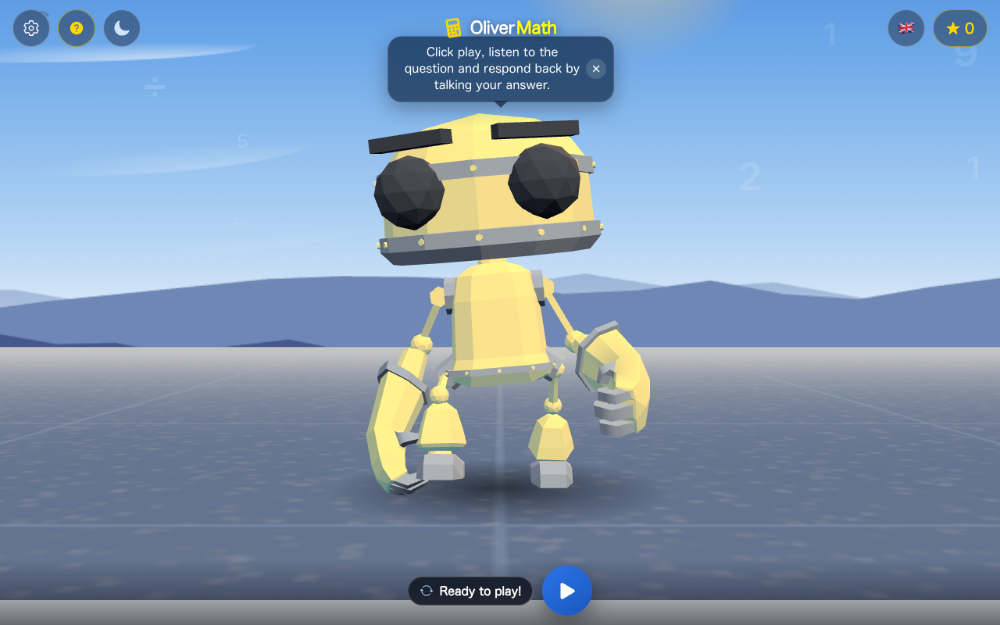
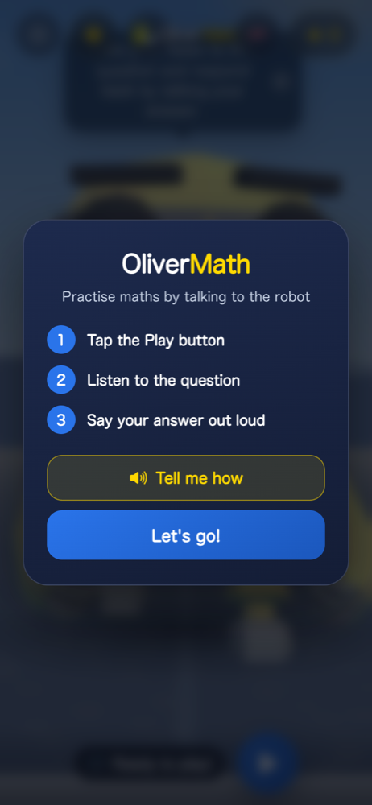
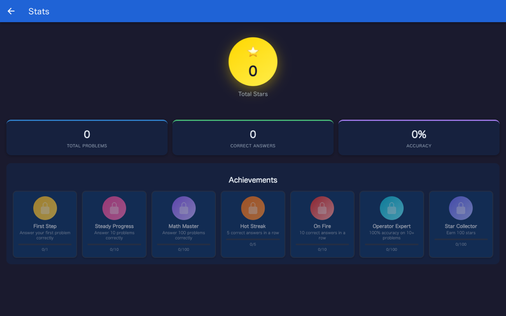

# Oliver Math

A voice-controlled maths game for children aged 7+. A 3D robot asks a question
out loud, the child answers by speaking, and correct answers earn stars.

**Play it: [victorsaly.github.io/OliverMath](https://victorsaly.github.io/OliverMath/)**

Made for Oliver, who wanted a robot that talks and listens like Alexa, but for
his times tables.



## What it offers

- **Speak your answer.** Azure Speech recognises what the child says. There is
  nothing to type and nothing to read.
- **Four operators, three levels.** Times, plus, minus and divide, each at
  beginner, medium and expert, with adaptive difficulty.
- **Practice modes** that revisit weak operators or recent mistakes.
- **A robot that reacts.** A 3D character listens, thinks, celebrates and
  commiserates, in a scene with a day/night cycle, drifting numbers and birds.
- **Explains itself out loud.** *Tell me how* has the robot read the
  instructions aloud, for children who can't read them fluently yet.
- **Five languages:** English, Spanish, French, German and Portuguese, including
  the robot's voice.
- **Stars, streaks and achievements**, with history and per-operator
  statistics.
- **Installable and offline-capable.** It is a PWA; the code, 3D model and
  assets are precached. Speech still needs a connection.

<p>
  
  &nbsp;
  
</p>

## Accessibility

The game is designed for a child who may not read fluently, so no state depends
on text alone:

- Every state is carried by colour, shape and motion together: the robot's
  colour, its expression, the ring on the floor, and a written word.
- Speaking and listening are visible with the sound off: the screen edges pulse
  blue while the robot talks and green while it listens.
- Silence is never scored as a wrong answer. In a noisy room a missed answer is
  the most likely outcome of a turn, so it earns a retry, not a failure.
- `prefers-reduced-motion` is honoured: decorative loops and confetti stop,
  while the feedback that carries meaning stays.
- Touch targets are 44px or larger, and pinch-zoom is not disabled.

## How it works

The frontend is a static Vue app on GitHub Pages. Anything that needs a key goes
through four Azure Functions in [`azure/functions`](azure/functions):

| Endpoint | Purpose |
| --- | --- |
| `GET /api/speechToken` | Issues a short-lived Azure Speech token, so the key never reaches the browser |
| `POST /api/validateAnswer` | Interprets the spoken answer (`"fifty six"` → `56`) and checks it |
| `POST /api/speak` | Text to speech |
| `POST /api/chat` | Chat proxy (OpenAI) |

three.js, the GLTF loader and the robot component are lazy chunks, loaded after
first paint. If WebGL is unavailable the robot falls back to a 2D Lottie
animation. The 3D scene pauses when off screen or when the tab is hidden.

Sound effects and the ambient music are synthesised with the Web Audio API.

## Tech stack

Vue 3, Ionic 8, Vite, three.js, Lottie, Azure Cognitive Services Speech SDK,
Azure Functions (Node), vite-plugin-pwa, Capacitor. Tests with Vitest and
Cypress.

## Run locally

Frontend:

```bash
npm install
npm run dev          # http://localhost:8100
```

The frontend runs on its own, but speech needs the backend. The only variable
the frontend reads is `VITE_API_BASE_URL` (see `.env.development`, which points
at `http://localhost:7071`).

Backend (needs [Azure Functions Core Tools](https://learn.microsoft.com/azure/azure-functions/functions-run-local)):

```bash
cd azure/functions
npm install
func start           # http://localhost:7071
```

Create `azure/functions/local.settings.json` (gitignored) with these values:
`FUNCTIONS_WORKER_RUNTIME` (`node`), `AzureWebJobsStorage`,
`AZURE_SPEECH_KEY`, `AZURE_SPEECH_REGION`, `OPENAI_API_KEY`, `OPENAI_MODEL`.
Set `Host.CORS` to allow the dev server's origin.

Other scripts:

```bash
npm run build      # production build into docs/
npm run lint       # eslint
npm run typecheck  # vue-tsc
npm run test:unit  # vitest
npm run test:e2e   # cypress
```

Pushes to `master` are built and deployed to GitHub Pages by
[`.github/workflows/deploy.yml`](.github/workflows/deploy.yml).

## Project structure

```
src/
  components/
    Robot3D.vue       3D robot, scene, day/night cycle, camera framing
    AnimatedBot.vue   picks 3D or Lottie, owns the speech bubble
    Achievements.vue  badges
  views/
    Home.vue          the game loop
    Stats.vue         progress and achievements
  services/           api, history, sound and music
  config/
    i18n.js           all five languages
    gameConfig.js     levels, operators, scoring
azure/functions/      the backend
```

## Credits

**RobotExpressive.glb** by [Tomás Laulhé](https://www.patreon.com/quaternius), CC0 1.0,
with facial morph targets added by [Don McCurdy](https://donmccurdy.com/).
Obtained from the [three.js](https://github.com/mrdoob/three.js) examples. See
[`public/models/CREDITS.md`](public/models/CREDITS.md).

---

Made by [Victor Saly](https://victorsaly.com).
